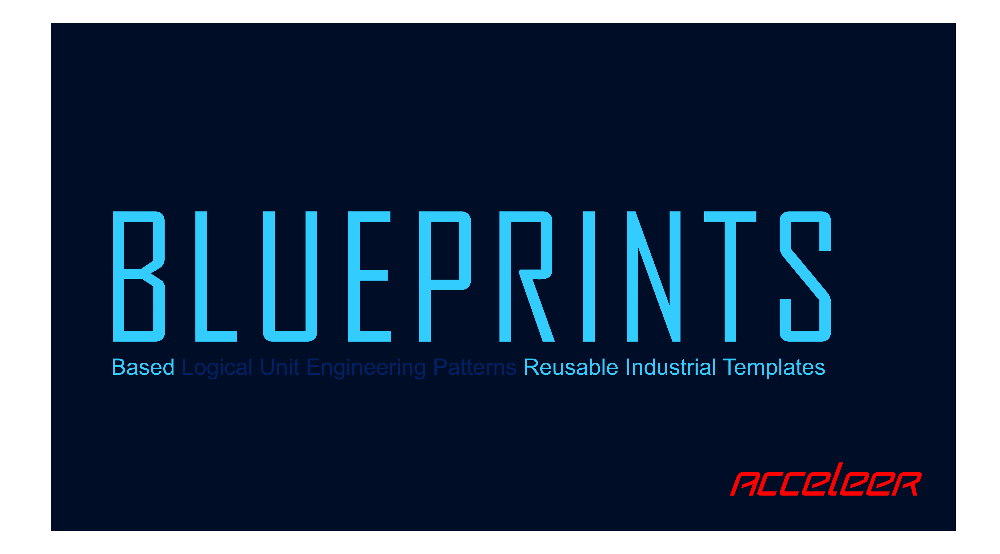

# The Future of Industrial Process Automation

- 🔥🚀 Accelerate  : Engineer 10x faster.
- 🕺🕺 Collaborate : Process Engineers x Automation Engineers x AI Agents
- ⚙️🏗️ Generate    : Deterministic Code-Generation at Scale
- 🤖✅ Trusted AI  : Agentic Functional Design > Human Review > Deterministic Code

# Purpose of B L U E P R I N T S

- Demonstrate a CLI-based Design-Ops workflow (for GUI-based: subscribe to [Acceleer](https://acceleer.com))
- Share and collaborate on Template Packages for different systems (Siemens, Rockwell, Beckhoff, ...) 

# Quick Start

## 1. Install Acceleer CLI

Run this command in PowerShell:

```powershell
irm https://github.com/acceleer/acceleer-cli/releases/latest/download/install.ps1 | iex
```

## 2. Clone this repo

```powershell
gh repo clone acceleer/blueprints
```


## 3. Generate PLC Code from FDS

```powershell
cd blueprints
```

```powershell
acceleer generate
```

## 4. What just happened 🤯✨? (Quick FAQ)

**Q: What just happened?**  
**A:** The CLI reads the functional design (FDS) from ./input/design-spec and generates a.o PLC Code to ./output

**Q: Is this for real projects?**  
**A:** YES! This is not a research project.  
This workflow is already used by multiple teams to bring real projects to production.  
The focus is on Food, Pharma, Fine Chemicals and other process manufacturing.   
From small skids to multi-plant standardizations.

**Q: The textual FDS looks cumbersome to edit.**  
**A:** This is only for demonstration and Agentic usage.  
There is a collaborative and convenient GUI Editor available when using the [Acceleer](https://acceleer.com) platform.

**Q: How to import the generated PLC/DCS code in the relevant IDE?**  
**A:** The [Acceleer](https://acceleer.com) platform comes with an agent that allows the import into different target systems.

**Q: Is there a community edition?**  
**A:** Yes, reserved for open-source and educational projects.

# Target systems/folder

## ./output/siemens-tia

Generates the PLC code for Siemens TIA in SCL.
Based on the templates in:
./input/template-packages/siemens-tia-cm
./input/template-packages/siemens-tia-main

## ./output/mtp

Generates an MTP (Module Type Package) file.
This will create two files:
- mtp_export.mtp: the full mtp file, which can be imported in software packages supporting MTP workflows
- mtp_export.xml: only for debugging, this is what is already packages inside mtp_export.mtp, but helps for faster analysis without having to unzip the mtp file